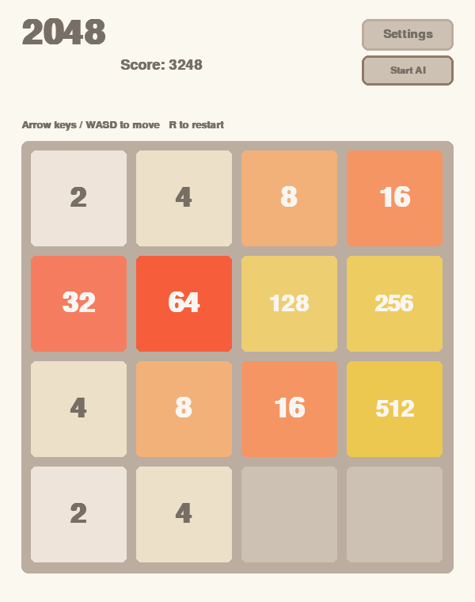
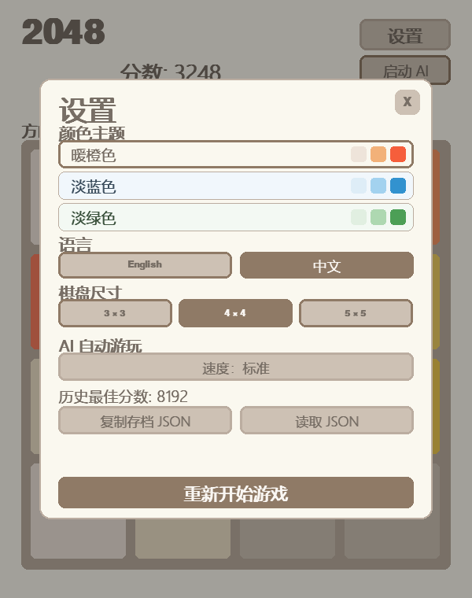
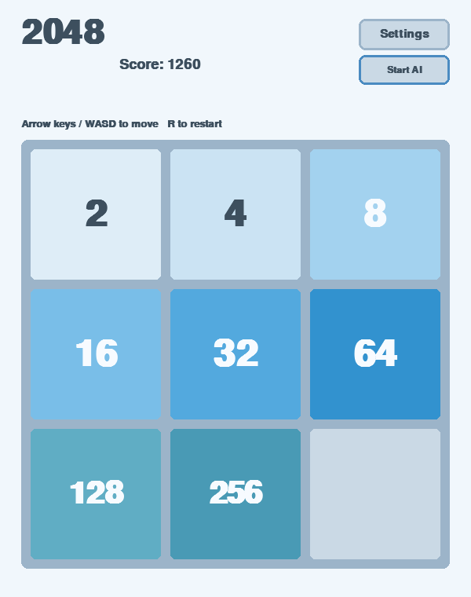
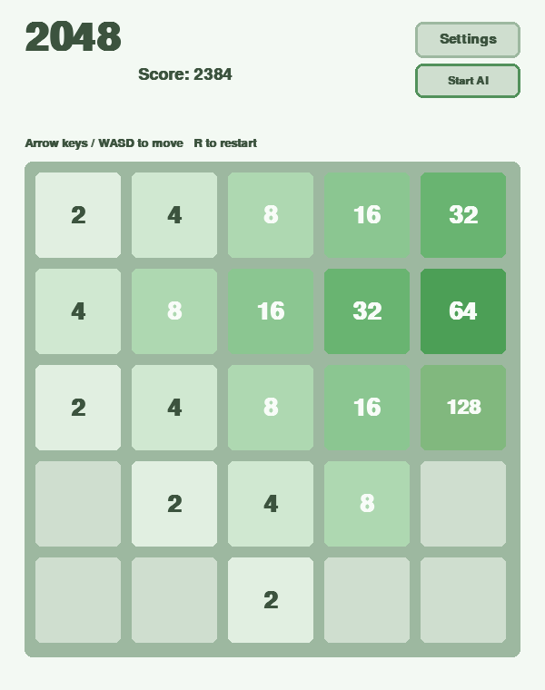

# Mini Game Collection

一个使用 **Python** 和 **Pygame** 开发的经典小游戏合集。

这个仓库用于练习游戏规则设计、图形界面开发和自动化测试，并会持续加入新的小游戏。项目采用简单、清晰的组织方式：每个游戏独立存放，核心规则尽量与 Pygame 界面分离，方便测试和后续扩展。

## 游戏列表

| 游戏 | 状态 | 简介 |
| --- | --- | --- |
| [2048](#2048) | 已完成，可持续优化 | 合并相同数字并挑战更高分数 |
| [贪吃蛇](#贪吃蛇) | 已完成，可持续优化 | 控制蛇吃食物成长并挑战更高分数 |

计划后续加入 Tetris、Minesweeper、Tic-Tac-Toe 和 Maze 等游戏。

## 2048

当前仓库中的第一个游戏，实现了完整的经典 2048 玩法，并支持多种棋盘尺寸。

### 游戏功能

- 可选择 3×3、4×4 或 5×5 棋盘
- 上、下、左、右四个方向移动
- 正确的数字压缩与合并规则
- 每次有效移动后随机生成 2 或 4
- 当前分数统计与游戏结束检测
- 快速、平滑的移动、合并弹跳和新方块出现动画
- 动画期间缓存最后一个方向输入，支持连续操作
- 合并后显示短暂的分数增加提示
- 随时重新开始游戏
- 暖橙色、淡蓝色和淡绿色三套主题
- 中文和英文界面即时切换
- 可拖动窗口边缘调整大小，界面自动适配
- 自动记录并持久化历史最佳分数
- 使用剪贴板导出和读取 JSON 文本存档
- 基于 Expectimax 搜索的 AI 自动游玩
- AI 支持启动、暂停以及慢速、标准、快速三档速度

### 游戏截图

| 默认 4×4 游戏画面 | 设置界面 |
| --- | --- |
|  |  |

| 3×3 棋盘 | 5×5 棋盘 |
| --- | --- |
|  |  |

### 操作方式

| 操作 | 功能 |
| --- | --- |
| 方向键或 `WASD` | 移动方块 |
| `R` | 重新开始当前游戏 |
| `Settings / 设置` | 打开设置界面 |
| `Start AI / 启动 AI` | 启动自动游玩；运行时按钮会变为暂停 AI |
| `Space` | 启动或暂停 AI 自动游玩 |
| 拖动窗口边缘 | 调整游戏窗口大小 |
| `Esc` | 关闭设置；设置未打开时退出游戏 |

AI 启停按钮位于主游戏界面的设置按钮下方。设置中可以选择棋盘尺寸、调整 AI 速度、切换颜色主题和语言、查看历史最佳分数、存档、读档以及重新开始游戏。玩家按下任意移动方向键时会自动暂停 AI 并立即接管游戏。

### AI 自动游玩

AI 使用 Expectimax 搜索，同时考虑玩家可选方向和随机生成方块的所有可能结果。棋盘评价会综合空格数量、数字排列单调性、相邻数字平滑度、潜在合并机会以及最大数字是否位于角落。

AI 的移动与玩家操作使用同一套游戏流程，因此会正常触发移动动画、合并效果、分数提示、最佳分数更新和游戏结束检测。重开或读档后 AI 默认暂停，存档不会记录“AI 正在运行”状态。

### JSON 存档与读档

点击设置中的 `Copy save JSON / 复制存档 JSON`，游戏会生成格式化的 JSON 文本并复制到剪贴板。可以将文本粘贴到任意文本文件中长期保存。

恢复游戏时，先复制完整的存档 JSON，再点击 `Load JSON / 读取 JSON`。存档会记录并恢复：

- 当前棋盘和分数
- 游戏结束状态
- 棋盘尺寸
- 历史最佳分数
- 颜色主题和界面语言
- 存档格式版本和保存时间

读取前会校验游戏类型、存档版本、棋盘尺寸、方块数字、分数和设置。无效 JSON 不会改变当前游戏。

历史最佳分数还会自动保存在 `games/game_2048/.player_data.json`。这是本地运行时数据，已被 Git 忽略，不会提交到仓库。

## 贪吃蛇

第二个游戏实现了经典贪吃蛇玩法。游戏规则采用固定时间步进，不受画面刷新率影响，并支持快速连续转向的输入缓冲。

### 游戏功能

- 24×18 自适应棋盘和整数像素网格
- 方向键与 WASD 操作，禁止直接反向移动
- 最多缓存两次转向，快速操作不会丢失
- 吃到食物后增长并增加 10 分
- 慢速、中速、快速三档固定速度
- 墙壁碰撞、自身碰撞和占满棋盘胜利检测
- 经典模式和跨边界后从对侧进入的里出外进模式
- 暂停、继续和随时重新开始
- 暂停后可打开设置界面，选择速度、主题和语言
- 花园、夜间和海洋三套主题，以及中文和英文界面
- 自动保存历史最佳分数、速度、主题和语言
- 可拖动窗口边缘调整大小，棋盘保持方形格子

### 操作方式

| 操作 | 功能 |
| --- | --- |
| 方向键或 `WASD` | 开始游戏或控制移动方向 |
| `Space` 或 `P` | 暂停或继续 |
| `S` 或暂停后的设置按钮 | 打开主题、语言和速度设置 |
| `R` | 重新开始并重新选择模式 |
| `1` / `2` | 在模式选择界面选择经典或里出外进模式 |
| `Esc` 或菜单按钮 | 返回游戏选择界面 |

贪吃蛇的历史最佳分数和偏好保存在 `games/game_snake/.player_data.json`。游戏规则位于纯 Python 模块中，不依赖 Pygame，因此可以独立测试移动、碰撞、食物生成和胜利条件。

## 项目结构

```text
mini-game-collection/
├── main.py                         # 小游戏合集入口
├── games/
│   ├── __init__.py
│   ├── menu.py                     # 游戏选择界面
│   ├── game_2048/
│       ├── __init__.py
│       ├── logic.py                # 棋盘、移动、合并和游戏状态
│       ├── ai.py                   # Expectimax 搜索和棋盘评价
│       ├── animation.py            # 移动轨迹与动画关键帧
│       ├── persistence.py          # JSON 存档和历史最佳分数
│       ├── config.py               # 主题、文案和界面配置
│       ├── ui.py                   # Pygame 布局与绘制
│       └── game.py                 # 输入处理和游戏主循环
│   └── game_snake/
│       ├── __init__.py
│       ├── logic.py                # 移动、成长、食物和碰撞规则
│       ├── persistence.py          # 历史最佳分数和偏好
│       ├── config.py               # 速度、主题、文案和界面配置
│       ├── ui.py                   # 响应式布局与绘制
│       └── game.py                 # 输入缓冲和固定步进主循环
├── docs/
│   └── images/
│       └── 2048/                   # 2048 的 README 展示截图
├── tests/
│   ├── support.py                  # 测试共用工具
│   ├── test_ai.py                  # AI 搜索和评价测试
│   ├── test_logic.py               # 核心规则测试
│   ├── test_animation.py           # 动画计算测试
│   ├── test_persistence.py         # 存档与最佳分数测试
│   ├── test_ui.py                  # 主题、语言和布局测试
│   ├── test_menu.py                # 合集菜单布局测试
│   ├── test_snake_logic.py         # 贪吃蛇核心规则和速度测试
│   ├── test_snake_persistence.py   # 贪吃蛇玩家数据测试
│   └── test_snake_ui.py            # 贪吃蛇响应式布局测试
├── requirements.txt                # 项目依赖
├── .gitignore
└── README.md
```

后续增加新游戏时，会在 `games/` 中为每个游戏建立独立目录，并在 `tests/` 中添加对应测试，避免不同游戏之间互相影响。

## 技术栈

- Python 3.10+
- Pygame 2.5+
- unittest（Python 标准库）

每个游戏都按职责划分模块：核心规则不依赖 Pygame，存档逻辑不依赖界面，`ui.py` 只负责绘制，`game.py` 负责协调输入和状态。这样修改某一部分时，不需要同时理解整个游戏。

## 安装与运行

### 1. 获取项目

```bash
git clone https://github.com/shiinawataru07/Mini-game-collection.git
cd Mini-game-collection
```

### 2. 创建虚拟环境（推荐）

```bash
python -m venv .venv
```

Windows PowerShell：

```powershell
.\.venv\Scripts\Activate.ps1
```

macOS / Linux：

```bash
source .venv/bin/activate
```

### 3. 安装依赖

```bash
python -m pip install -r requirements.txt
```

### 4. 启动游戏

```bash
python main.py
```

入口会显示游戏选择界面。可以用鼠标选择，也可以按 `1` 启动 2048、按 `2` 启动贪吃蛇。游戏内按 `Esc` 可返回选择界面。

## 运行测试

```bash
python -m unittest discover -s tests -v
```

测试覆盖以下关键行为：

- 不同数字组合的压缩与合并
- 四个方向的棋盘移动
- 分数计算和随机方块生成
- 游戏结束与重新开始
- 主题、语言和响应式布局配置
- 动画移动轨迹、合并位置和缩放关键帧
- AI 合法移动、随机概率、棋盘评价和决策稳定性
- JSON 存档生成、解析与非法数据拒绝
- 历史最佳分数本地保存
- 贪吃蛇移动、成长、碰撞、胜利与蛇尾边界规则
- 贪吃蛇固定速度档位、玩家偏好保存和响应式布局
- 游戏选择菜单在不同窗口尺寸下的布局

## 后续计划

### 小游戏合集

- 逐步加入 Tetris、Minesweeper、Tic-Tac-Toe 和 Maze
- 只在多个游戏确实需要时提取共享组件和通用设置

### 项目完善

- 使用 GitHub Actions 自动运行测试
- 为后续新增的游戏补充截图或演示 GIF
- 使用 PyInstaller 提供无需安装 Python 的可执行版本
- 通过 GitHub Releases 发布带版本号的稳定构建
