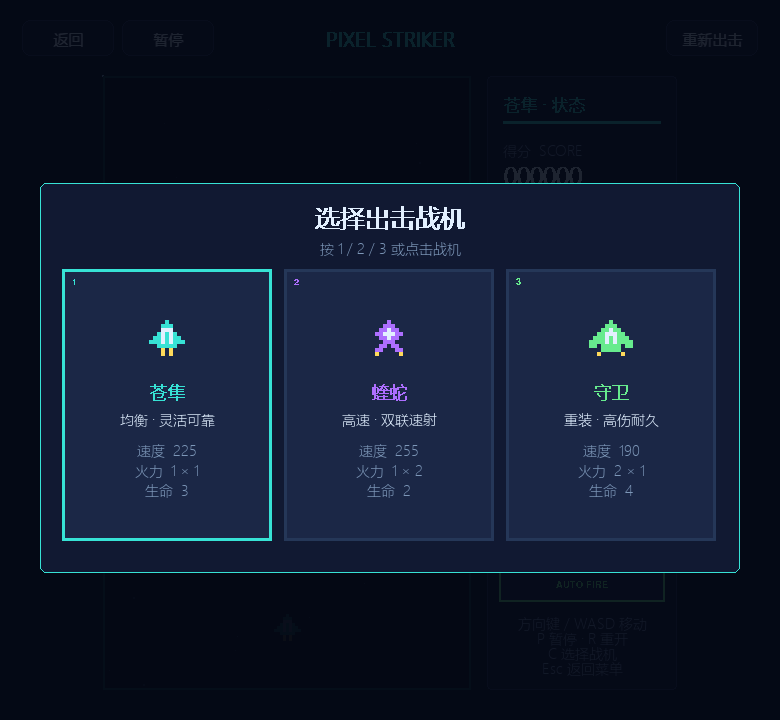
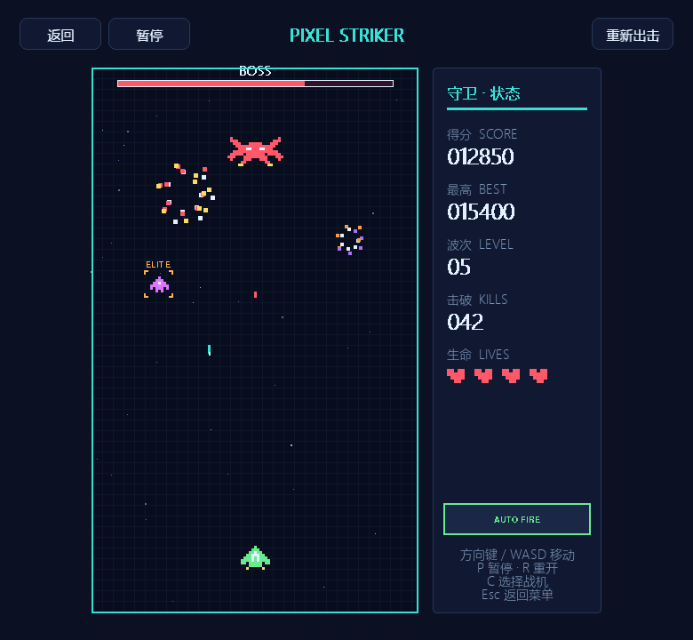
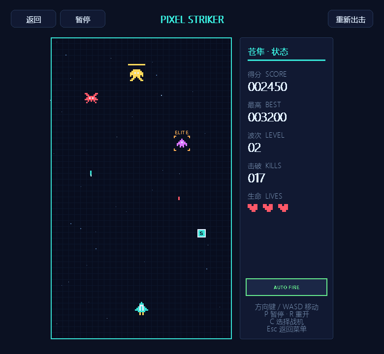

# 像素飞机大战（Pixel Striker）

一款纵向卷轴像素射击小游戏。驾驶战机在星空中自动射击，躲避敌机与弹幕并挑战更高波次。

## 游戏截图

| 三款战机选择 | Boss 与精英敌机实战 |
| --- | --- |
|  |  |

### 普通波次

## 操作

- `方向键` / `WASD`：移动战机
- `P`：暂停或继续
- `R`：立即重新开始
- `C`：重新选择战机
- `1` / `2` / `3`：选择苍隼、蝰蛇或守卫
- `Space`：起飞；失败后重新开始
- `Esc`：返回小游戏菜单
- `M` / `-` / `+` / `F11`：使用合集统一的静音、音量和全屏快捷键

## 规则与特色

- 战机会自动射击，击落 10 架敌机后提升一个波次。
- 可选择均衡的“苍隼”、高速双联的“蝰蛇”或高伤耐久的“守卫”。
- 敌机分为普通无人机、高速侦察机和高耐久重型机，并可能强化为精英单位。
- 精英敌机拥有更高耐久、更密集的双发弹幕和双倍击破分数。
- 第 5 波开始，每隔 5 波出现一场 Boss 战；Boss 拥有独立血条、五向弹幕和必掉道具。
- 敌机、精英、Boss 和玩家受伤均有不同规模的像素爆炸动画。
- 被击中或让敌机突破防线会损失生命；受伤后会短暂无敌。
- 敌机有概率掉落快速射击、能量护盾和生命修复三种道具。
- 最高分自动保存在游戏目录的本地 JSON 数据中。
- 所有像素图形和街机音效均由程序生成，不依赖外部素材。
