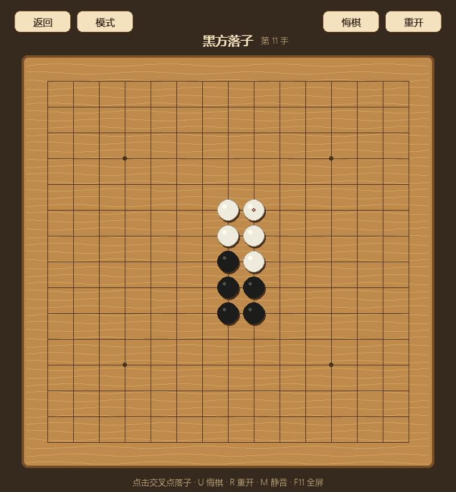
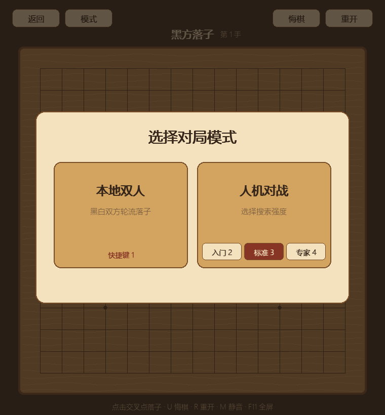
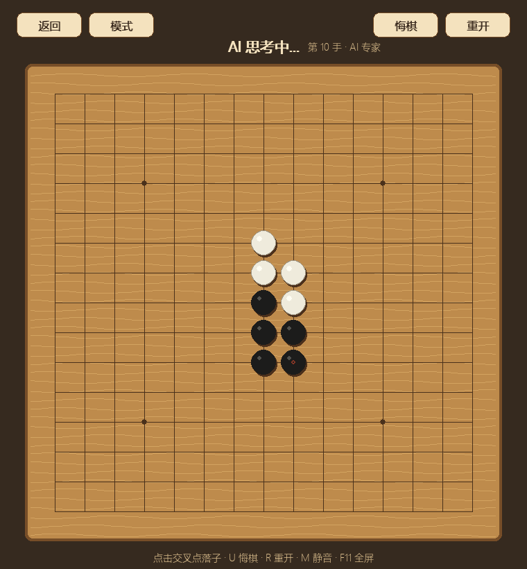

# 五子棋

> 全局快捷键：`M` 静音，`-` / `+` 调节音量，`F11` 切换全屏。

[返回小游戏合集](../../README.md)

五子棋采用 15×15 的古朴木质棋盘与传统黑白棋子，支持本地双人和人机对战。
当前 AI 具备即时攻防、邻域候选生成、棋型评估和迭代加深搜索，并在后台思考以保持
界面流畅。

三档强度的单步思考预算分别约为：入门 0.18 秒、标准 0.7 秒、专家 1.8 秒。实际耗时
会因局面是否存在可证明的强制杀棋而略有变化。

AI 的规则基线、搜索架构、强度指标和分阶段路线见 [AI_DESIGN.md](AI_DESIGN.md)。
专家级 CPU 引擎的下一阶段方案见 [M3_DESIGN.md](M3_DESIGN.md)。

## 游戏截图

| 本地双人对局 | 三档人机模式选择 |
| --- | --- |
|  |  |

### 专家 AI 对局

## 当前功能

- 本地黑白双方轮流落子
- 横向、纵向和两种斜线五连胜负判定
- 最近一步标记与获胜连线提示
- 对局中或胜负结束后悔棋
- 重新开始和重新选择模式
- 响应式木棋盘、落子预览和黑白棋子立体绘制
- 落子、悔棋和获胜音效
- 全局音量、静音和全屏设置
- 玩家执黑的人机模式与后台 AI 思考状态
- 入门、标准和专家三档 AI 搜索强度
- AI 一步胜、一步防、精确棋型分类、VCF 与 PVS 搜索

## 操作

| 操作 | 功能 |
| --- | --- |
| 鼠标左键 | 在棋盘交叉点落子 |
| `U` 或 `Backspace` | 悔棋 |
| `R` | 重新开始当前模式 |
| `1` | 在模式选择中启动本地双人对战 |
| `2` / `3` / `4` | 启动入门、标准或专家人机对战 |
| `Esc` | 关闭模式选择或返回合集菜单 |

核心落子、胜负判断与悔棋规则位于 `logic.py`，不依赖 Pygame。
