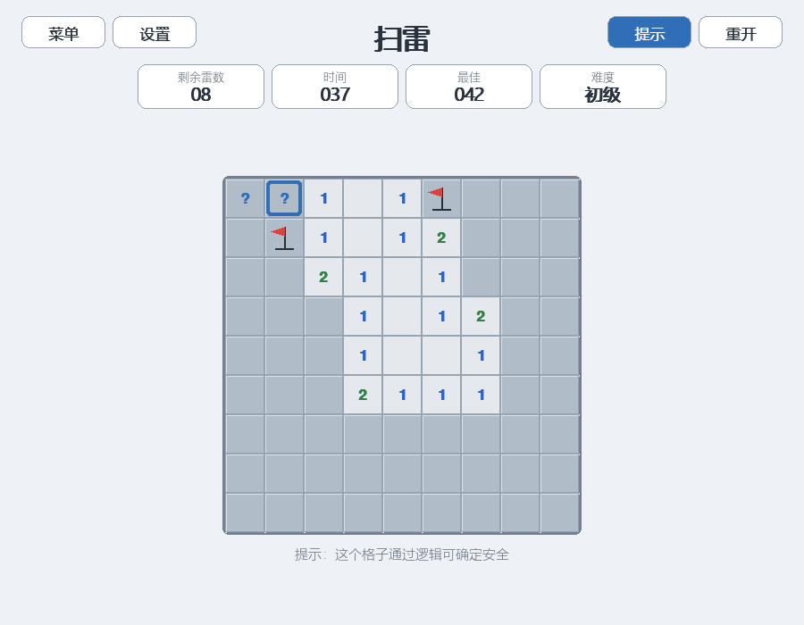
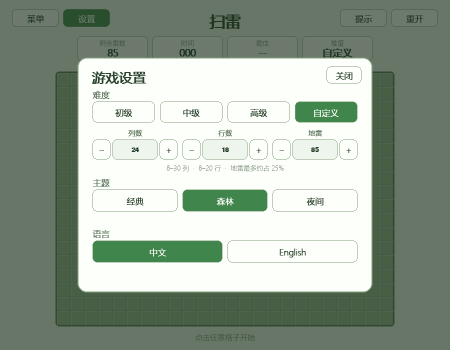
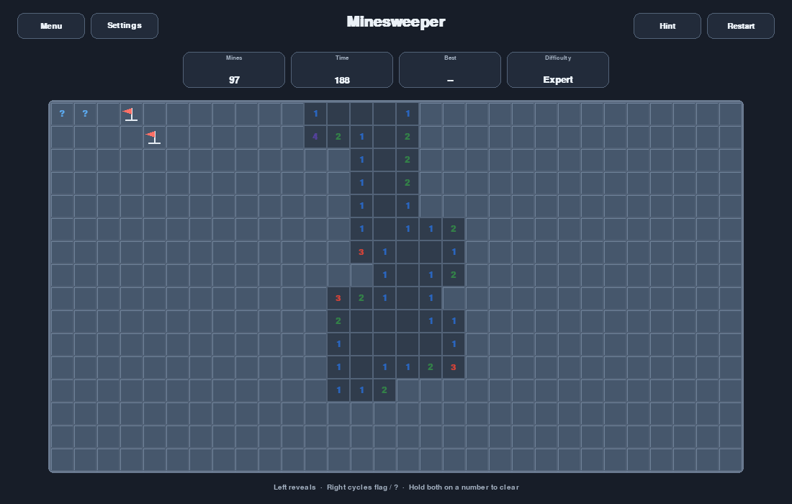
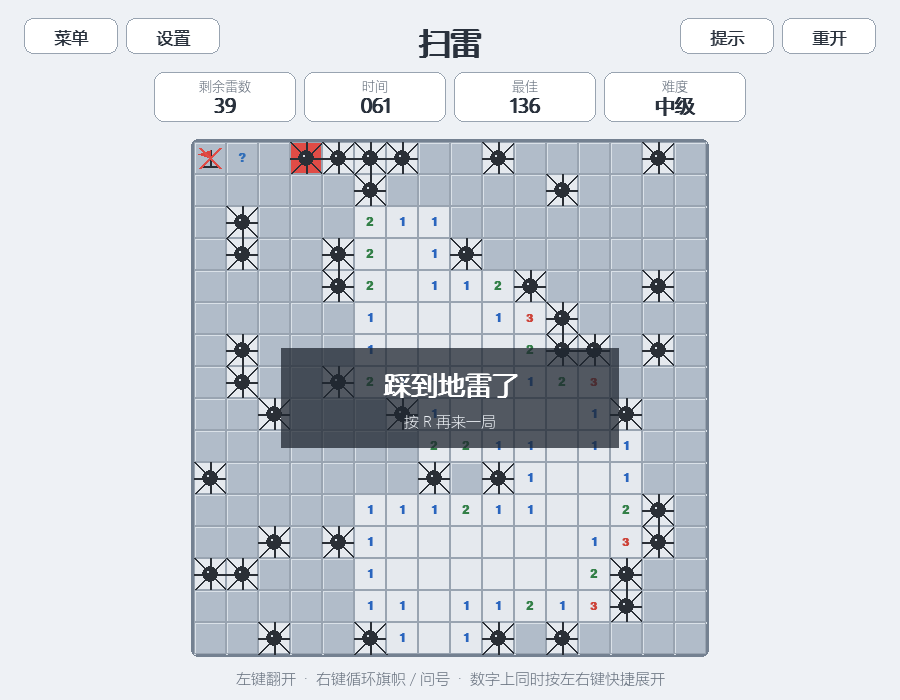

# 扫雷

[返回小游戏合集](../../README.md)

扫雷是本合集中的第三个游戏。玩家需要翻开所有安全格，并利用数字推断地雷位置。当前实现使用内置约束求解器验证棋盘，保证每局都能在不猜测的情况下完成，同时提供逻辑提示、三种经典难度、自定义棋盘、首次点击安全、双语界面、多套主题和各预设难度最佳时间记录。

## 游戏功能

- 初级：9×9，10 个地雷
- 中级：16×16，40 个地雷
- 高级：30×16，99 个地雷
- 自定义：8–30 列、8–20 行，地雷最多约占棋盘的 25%，且不超过 120 个
- 第一次翻开的格子及周围八格不会生成地雷
- 每次布雷都由求解器验证，无法纯逻辑解开的布局会自动重新生成
- 零相邻雷区域自动连锁展开
- 支持旗帜、问号、取消标记和剩余雷数显示
- 旗帜可以超过地雷总数，剩余雷数会相应显示为负数
- 在数字格同时按鼠标左右键可快捷展开周围格子
- 错误旗帜可能在快捷展开时触雷
- 当前用时和各难度历史最佳时间
- 提示按钮或 `H` 键可标出逻辑安全格、确定地雷或错误旗帜
- 触雷时播放爆炸音效，完成棋盘时播放胜利音效
- 经典、森林和夜间三套主题
- 中文和英文界面
- 响应式窗口和整数像素方格

## 游戏截图

| 初级游戏与求解器提示 | 自定义棋盘设置 |
| --- | --- |
|  |  |

| 高级夜间棋盘 | 失败、问号和错误旗帜 |
| --- | --- |
|  |  |

## 操作方式

| 操作 | 功能 |
| --- | --- |
| 鼠标左键 | 翻开格子 |
| 鼠标右键 | 按“旗帜 → 问号 → 无标记”循环切换 |
| 在数字格同时按鼠标左右键 | 当周围旗帜数与数字相等时，快捷展开其余相邻格 |
| `H` 或提示按钮 | 调用求解器，高亮一个可确定的安全格、地雷格或错误旗帜 |
| `R` | 重新开始当前难度 |
| `1` / `2` / `3` | 切换到初级、中级或高级并开始新局 |
| `S` | 打开或关闭设置 |
| `Esc` | 关闭设置；设置未打开时返回游戏选择界面 |
| 菜单、设置、重开按钮 | 执行对应操作 |

## 规则说明

游戏在第一次翻开格子时才生成地雷，因此首次点击及其周围八格一定安全。每个候选布局都会交给求解器模拟完成；如果求解器需要猜测，游戏会丢弃该布局并重新布雷。数字表示该格周围八个位置中的地雷数量。翻开数字为零的格子会自动展开相邻区域。

当一个已翻开数字周围的旗帜数量与数字相等时，在该数字格同时按住鼠标左右键会翻开其余相邻格。如果旗帜位置错误，快捷展开可能直接触发未标记的地雷。问号只用于记录不确定位置，不计入周围旗帜数；问号格可以直接翻开，也会被空白区域连锁展开。

翻开所有非地雷格即可获胜，不要求手动标记全部地雷。获胜后会自动标记剩余地雷；失败后会显示全部地雷、爆炸位置和错误旗帜。

## 纯逻辑求解与提示

核心推理只使用玩家当前可见的数字、旗帜和剩余雷数。生成验证会按照推理结果模拟操作并确认能够完成棋盘；提示层还会校验建议的安全性，并在玩家标错旗导致约束矛盾时指出错误标记。求解器会重复应用：

- 数字周围旗帜数已等于数字时，其余相邻格均安全
- 数字剩余雷数等于未知格数量时，所有未知格均为地雷
- 一个约束集合完全包含另一个约束集合时，对两者做差得到新的安全格或地雷格
- 剩余雷数为零或等于全部未知格数量时，使用全局剩余雷数完成推断

点击提示后，蓝色边框表示可安全翻开的格子，红色边框表示可确定的地雷；如果玩家插错旗，提示会用危险色指出错误旗帜。提示只高亮位置，不会代替玩家操作，也不会暂停计时。

## 设置与玩家数据

打开设置时计时暂停。设置中可以：

- 切换初级、中级和高级难度；切换难度会开始新局
- 选择自定义难度并调整列数、行数和地雷数；调整后立即开始对应新局
- 选择经典、森林或夜间主题
- 切换中文和英文界面

各预设难度最佳时间、当前难度、自定义棋盘参数、主题和语言保存在游戏目录的 `.player_data.json`。自定义局不记录最佳时间，避免不同棋盘规格的成绩混在一起。该文件是本地运行时数据，已被 Git 忽略。

## 代码结构

| 文件 | 职责 |
| --- | --- |
| `logic.py` | 延迟布雷、数字计算、连锁展开、插旗、快捷展开、胜负和计时 |
| `solver.py` | 约束推理、纯逻辑棋盘验证和提示选择 |
| `input.py` | 单键点击和左右键组合手势状态 |
| `sound.py` | 无外部音频文件依赖的触雷与胜利合成音效 |
| `persistence.py` | 预设难度最佳时间、自定义棋盘参数和玩家偏好 |
| `config.py` | 难度、主题、双语文案和窗口配置 |
| `ui.py` | 响应式棋盘、格子状态、设置和结果界面绘制 |
| `game.py` | 鼠标与键盘输入、计时暂停、记录更新和主循环 |
| `preview.py` | 合集菜单中的扫雷预览图 |

核心规则不依赖 Pygame，可以独立验证首击安全、布雷数量、相邻雷数、连锁展开、快捷展开和胜负条件。
