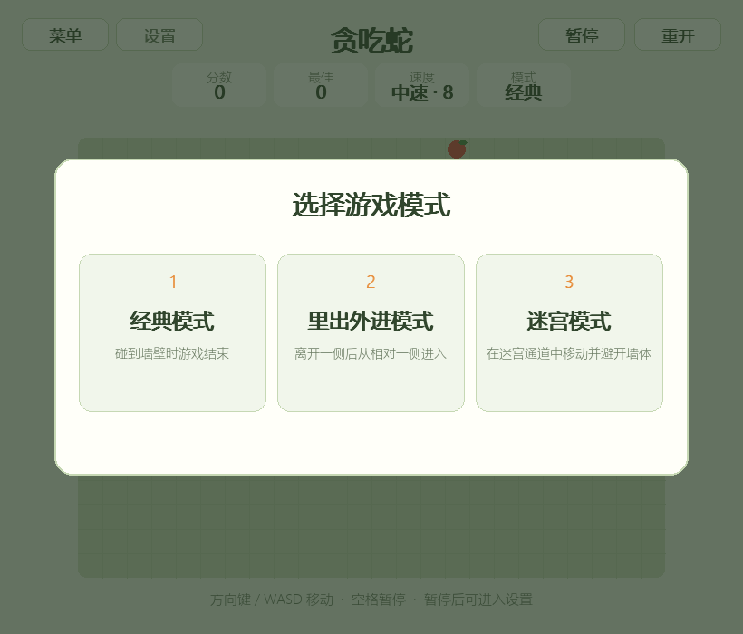
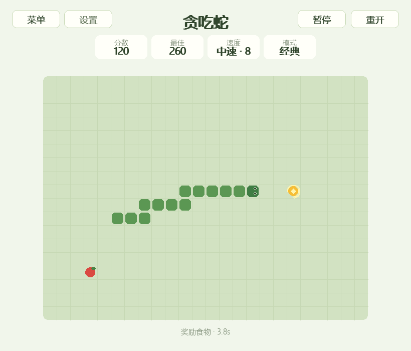
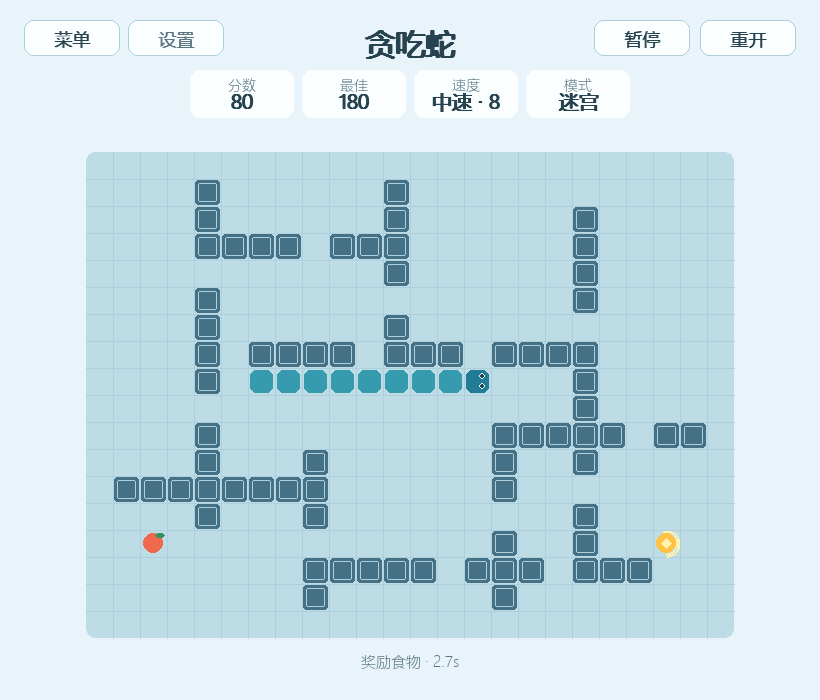
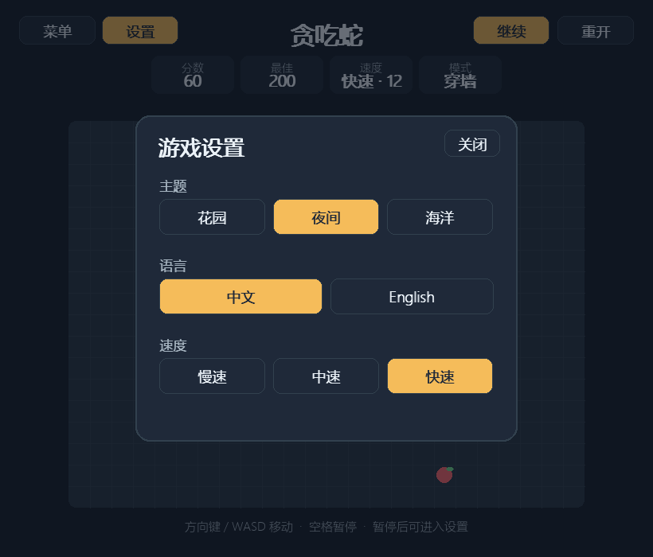
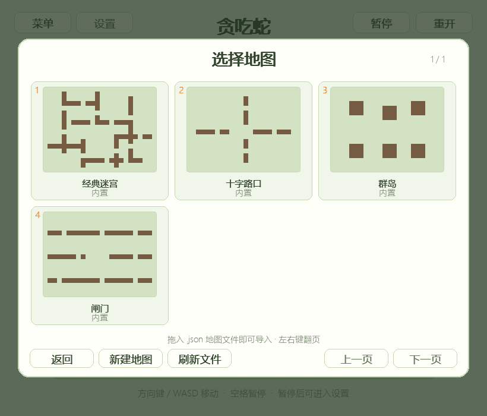
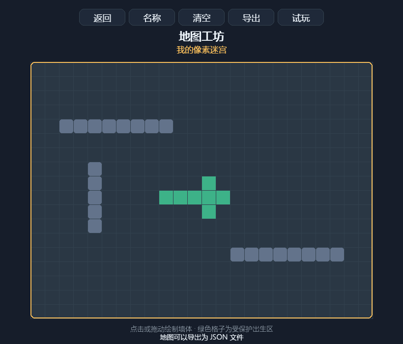

# 贪吃蛇

> 全局快捷键：`M` 静音，`-` / `+` 调节音量，`F11` 切换全屏。普通食物、奖励食物、碰撞和胜利均有音效反馈。

[返回小游戏合集](../../README.md)

贪吃蛇是本合集中的第二个游戏。玩家控制蛇在棋盘中寻找食物，蛇会随进食成长，需要避开危险并争取更高分数。游戏支持经典、里出外进、内置迷宫和地图工坊，同时提供奖励食物、三档固定速度、双语界面和多套主题。

## 游戏功能

- 24×18 自适应棋盘和整数像素网格
- 方向键与 WASD 操作，禁止直接反向移动
- 最多缓存两次转向，快速操作不会丢失
- 吃到食物后增长并增加 10 分
- 每吃 5 个普通食物生成一个限时奖励食物
- 奖励食物存在 5 秒，吃到后增加 50 分并增长一格
- 慢速、中速、快速三档固定速度
- 自身碰撞和占满棋盘胜利检测
- 经典、里出外进和迷宫三种模式
- 四张经过连通性验证的内置地图：经典迷宫、十字路口、群岛和闸门
- 游戏内地图编辑器，可用鼠标连续绘制或擦除墙体、命名、清空和直接试玩
- 使用版本化 JSON 文件导出地图，并通过地图目录扫描或拖放文件导入
- 地图文件自动校验尺寸、坐标、出生区、可游玩空间和区域连通性
- 暂停、继续和随时重新开始
- 暂停后可打开设置界面，选择速度、主题和语言
- 花园、夜间和海洋三套主题
- 中文和英文界面
- 自动保存历史最佳分数、速度、主题和语言
- 响应式窗口，棋盘始终保持方形格子

## 游戏截图

| 三种游戏模式 | 经典模式与奖励食物 |
| --- | --- |
|  |  |

| 迷宫模式 | 暂停设置界面 |
| --- | --- |
|  |  |

| 地图库 | 地图编辑器 |
| --- | --- |
|  |  |

## 游戏模式

每次进入贪吃蛇或重新开始时，都需要选择游戏模式：

| 模式 | 规则 |
| --- | --- |
| 经典模式 | 蛇碰到棋盘墙壁时游戏结束 |
| 里出外进模式 | 蛇离开棋盘一侧后，会从相对一侧重新进入 |
| 迷宫模式 | 使用经典迷宫地图，撞到墙体时游戏结束 |
| 地图工坊 | 选择更多内置地图、导入地图文件，或制作和试玩自己的地图 |

所有玩法中撞到自身都会结束游戏。蛇占满所有可行走格子时则判定胜利。

## 地图工坊与地图文件

在模式选择界面按 `4` 或点击“地图工坊”进入地图库。地图库会显示四张内置地图，以及从地图目录中发现的自定义文件：

- Windows 默认目录：`%USERPROFILE%\MiniGameCollection\snake_maps`
- macOS / Linux 默认目录：`~/MiniGameCollection/snake_maps`
- 将 `.json` 地图文件拖入地图库窗口可以立即导入；也可以复制到上述目录后点击“刷新文件”。
- 编辑器中的“导出”会在地图目录生成独立的 `.snake-map.json` 文件，文件可以复制和分享。

地图文件采用可读的版本化 JSON 格式：

```json
{
  "format": "mini-game-collection.snake-map",
  "version": 1,
  "name": "我的地图",
  "width": 24,
  "height": 18,
  "walls": [[2, 3], [3, 3], [4, 3]],
  "author": "",
  "description": ""
}
```

编辑器固定使用 24×18 棋盘；导入器支持 8～40 格宽、6～30 格高的地图。绿色区域是贪吃蛇出生位置与初始出口，不能放置墙体。导出和试玩前会验证所有空白区域互相连通，避免食物生成在无法到达的位置。

## 奖励食物

奖励食物与普通食物同时存在，使用金色外观和倒计时环表示：

- 每吃掉 5 个普通食物，就会在空闲格子生成一个奖励食物。
- 奖励食物不会与蛇身、普通食物或迷宫墙体重叠。
- 奖励食物存在 5 秒，超时后自动消失。
- 吃到奖励食物可获得 50 分，蛇身增长一格。
- 暂停游戏或打开设置时，奖励食物倒计时停止。

## 速度等级

速度不会随分数改变，可在暂停后的设置界面中选择：

| 等级 | 固定速度 |
| --- | --- |
| 慢速 | 每秒移动 4 格 |
| 中速 | 每秒移动 6 格 |
| 快速 | 每秒移动 9 格 |

## 操作方式

| 操作 | 功能 |
| --- | --- |
| 方向键或 `WASD` | 开始游戏或控制移动方向 |
| `Space` 或 `P` | 暂停或继续 |
| `S` 或暂停后的设置按钮 | 打开主题、语言和速度设置 |
| `R` | 重新开始并重新选择模式 |
| `1` / `2` / `3` / `4` | 选择经典、里出外进、迷宫或地图工坊 |
| 地图库中的 `1`～`6` | 打开当前页对应的地图 |
| 地图库中的 `E` / `R` / `←` / `→` | 新建地图、刷新文件或翻页 |
| 编辑器中的 `N` / `Ctrl+S` / `Enter` | 编辑名称、导出文件或试玩地图 |
| `Esc` | 关闭设置；设置未打开时返回游戏选择界面 |
| 菜单按钮 | 返回游戏选择界面 |

## 设置与玩家数据

游戏暂停后，“设置”按钮会启用。设置界面支持：

- 在花园、夜间和海洋主题间切换
- 在中文和英文间切换
- 选择慢速、中速或快速

历史最佳分数、速度、主题和语言保存在当前目录的 `.player_data.json`。这是本地运行时数据，已被 Git 忽略，不会提交到仓库。游戏模式不会保存，因为每次进入或重开都需要重新选择。自定义地图保存在用户目录的 `MiniGameCollection/snake_maps` 中，与玩家偏好相互独立，便于复制和分享。

## 规则细节

- 蛇头是蛇身坐标序列中的第一个元素。
- 普通移动时，新蛇头加入，旧蛇尾同时移除。
- 吃到食物时旧蛇尾不移除，因此蛇身增长一格。
- 没有吃到食物时，蛇头可以进入正要离开的旧蛇尾位置。
- 食物只会生成在未被蛇身占据的格子里。
- 普通食物和奖励食物不会生成在迷宫墙体上。
- 棋盘被蛇占满后不再生成食物，并进入胜利状态。
- 游戏规则采用固定时间步进，不受画面刷新率影响。

## 代码结构

| 文件 | 职责 |
| --- | --- |
| `logic.py` | 移动、转向、成长、普通与奖励食物、碰撞和模式规则 |
| `maps.py` | 内置地图、编辑状态、地图校验及 JSON 导入导出 |
| `persistence.py` | 历史最佳分数与玩家偏好 |
| `config.py` | 固定速度、主题、文案和界面配置 |
| `ui.py` | 棋盘、迷宫、奖励食物、模式选择和响应式绘制 |
| `game.py` | 输入缓冲、固定步进和游戏状态协调 |

核心规则和地图文件层不依赖 Pygame，可以独立测试移动、碰撞、奖励食物、迷宫墙体、穿越边界、连通性校验、文件往返和胜利条件。
