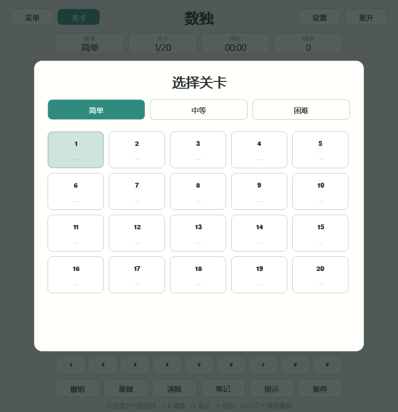
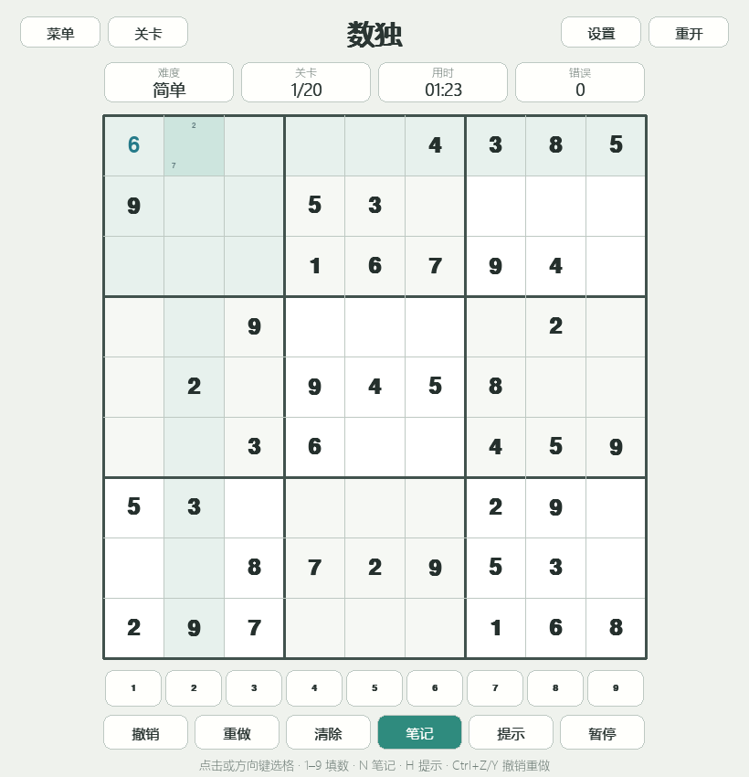

# 数独

> 全局快捷键：`M` 静音，`-` / `+` 调节音量，`F11` 切换全屏。

[返回小游戏合集](../../README.md)

经典 9×9 数独闯关游戏。每一行、每一列和每一个 3×3 宫内都需要填入 1～9，且数字
不能重复。游戏提供三档难度共 60 关，并保存每一关的最佳完成时间。

## 游戏截图

| 关卡选择 | 游戏进行中 |
| --- | --- |
|  |  |

## 关卡与难度

- **简单**：20 关，每关 40 个已知数
- **中等**：20 关，每关 35 个已知数
- **困难**：20 关，每关 30 个已知数
- 所有关卡都有唯一解，并在自动化测试中逐关重新验证题目、答案和唯一性
- 已完成关卡会在关卡选择界面显示最佳时间

题库由项目内的确定性生成器独立生成。三档线索数参考了 MIT 许可的
[Sudoku Puzzle Generator](https://github.com/alicommit-malp/sudoku) 所公开的默认配置，
项目没有复制其题目或代码。运行 `python tools/generate_sudoku_levels.py` 可以使用固定种子
重新生成完全一致的 60 关题库。

## 操作

- 鼠标点击或方向键：选择格子
- `1`～`9`：填入数字；开启笔记模式后切换候选数字
- `0`、`Backspace` 或 `Delete`：清除当前格
- `N`：开启或关闭候选笔记
- `H`：填入一个提示数字
- `Ctrl+Z` / `Ctrl+Y`：撤销 / 重做
- `P` 或 `Space`：暂停或继续
- `R`：重新开始当前关卡
- `L`：打开关卡选择
- `S`：打开设置
- `Esc`：关闭弹窗或返回游戏集合

## 功能

- 同行、同列和同宫高亮，重复或错误数字即时标红
- 每格支持 1～9 候选笔记，填入数字后自动清理相关格中的相同候选
- 100 步撤销历史和对应的重做历史
- 提示次数、错误次数、用时和逐关最佳时间记录
- 纸张、夜间和樱花三套主题，以及中英文界面
- 填数、笔记、错误、提示、撤销/重做和完成均有程序合成音效

核心规则与状态转换位于 `logic.py`，求解与唯一性校验位于 `solver.py`，固定关卡数据位于
`levels.py`。Pygame 界面、输入主循环和本地进度分别由 `ui.py`、`game.py` 和
`persistence.py` 负责。
