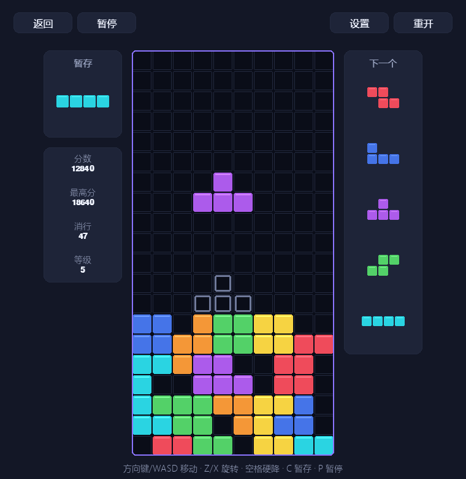
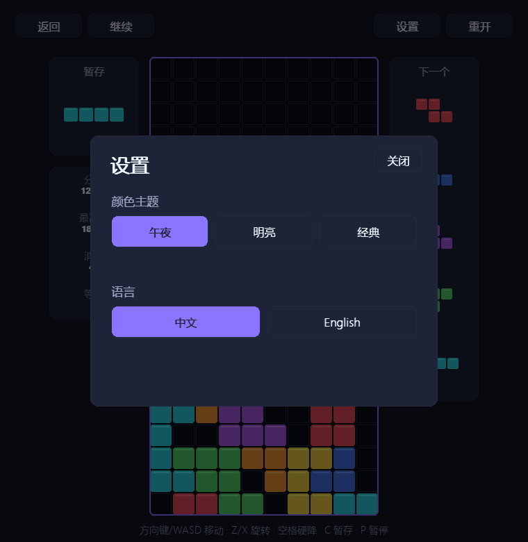
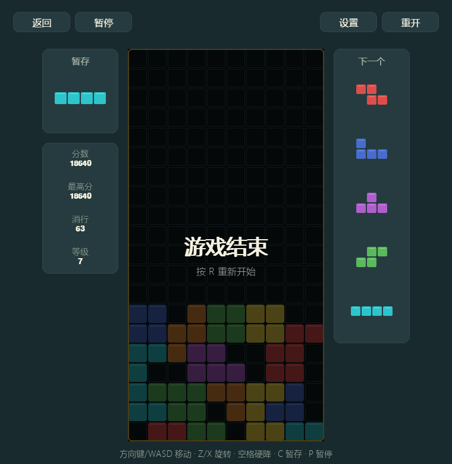

# 俄罗斯方块

> 全局快捷键：`M` 静音，`-` / `+` 调节音量，`F11` 切换全屏。旋转、暂存、锁定、消行和游戏结束均有音效反馈。

[返回小游戏合集](../../README.md)

经典的下落方块消行游戏。本实现使用 10×20 可见棋盘和两行隐藏出生区，并遵循 SRS
旋转与踢墙规则。

## 游戏截图

| 游戏进行中 | 设置界面 |
| --- | --- |
|  |  |

### 游戏结束

## 操作

- `←` / `→` 或 `A` / `D`：水平移动
- `↓` 或 `S`：软降
- `↑`、`X` 或 `W`：顺时针旋转
- `Z`：逆时针旋转
- `Space`：硬降
- `C` 或 `Shift`：暂存方块
- `P`：暂停或继续
- `R`：重新开始
- `Esc`：返回游戏集合

## 规则与功能

- 7-bag 随机系统、未来五个方块预览和 Hold
- SRS 旋转、Ghost Piece、DAS/ARR 连续移动
- 500ms 锁定延迟，触地后的移动或旋转最多重置 15 次
- 每消除 10 行提升一级，等级越高自然下落越快
- 单消、双消、三消、四消分别获得 `100/300/500/800 × 等级` 分
- 软降每格 1 分，硬降每格 2 分，连续消行提供 Combo 奖励
- 三套颜色主题、中英文界面、最高分和最多消行本地记录

核心规则位于 `logic.py` 和 `pieces.py`，不依赖 Pygame。窗口、输入与绘制分别由
`game.py`、`input.py` 和 `ui.py` 负责。
